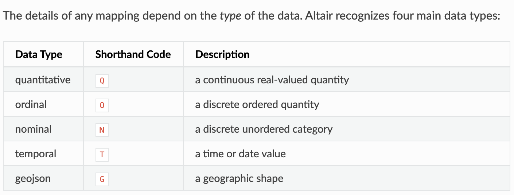

# Visual Analytics (VA) INM433

## Contents

[Week 1 Notes](#Week-1-Notes)

## Week 1 Notes 

**Read Chapter 3 of Visual Analytics in Data Science**

Visual analytics is useful when we cannot get a machine to calculate metrics and other forms of numerical insights from data easily.

Examples of suitable questions that VA can answer are:

How have patterns of crime been affected by recent cuts and what are the possible reasons?
What effect does weather have on cycling behaviour?
How predicable are our customers’ buying preferences?
How does political preference on social media relate to that in opinion polls?
What kinds of mass events can we detect with Twitter output?

VA can also help with: 

Exploratory analysis - does the data seem suitable?

Comparison of data distributions, statistical/algorithmic output, different assumptions and parameters

### Visual Analytics Theory

#### Interaction

Interaction is a key concept, which deals with allowing humans, i.e. analysts, to interactively request more contextual data on demand. 

It is the glue that enables the tight-coupling of computational and visualisation techniques.

It also covers the investigation of different ways of configuring computational methods and alternative models for more informed analysis. In other words, analysts can change computational techniques, model parameters, data etc easily through advancements in computational speed and software frameworks. Examples of this are Tableau, Alteryx etc. 

#### Visual Variables

Graphical representation of data is the encoding (conversion) of components of data by means of **visual variables**. 

##### Position

**Position** is the most important visual variable. The values of this variable are positions along some axis, for example if we consider the most common x and y axes, this two-dimensional space employs two instances of the position variable, x and y.

We can also use positions to judge distance between data/visual elements through scales.

##### Marks 

Once we have our position variables, we plot our data points based on the values of these position variables. The way we represent these data points are called **marks**, such as dots, lines symbols etc, i.e. graphical elements.

The official three types of marks are:

1. Point
2. Line
3. Area 

#### Retinal

The remaining visual variables are part of a group called **retinal variables**:

- Size - e.g. large, small, thick, thin etc. We can also order visual elements by size.
- Colour Value (Lighhtness vs Darkness) - i.e. representation of a colour's brightness.
- Colour/Shade (Hue)
- Texture - the way an artist creates an implied sense of texture (surface characteristics such as rough or smooth and appearance of an object), e.g. dashed lines, polka dots etc.
- Orientation - e.g. angles, degrees, i.e. in what direction the object is positioned.
- Shape

#### Examples of Visual Variables in Graphs

##### Scatter Plot

Positions = X and Y position values

Marks = the individual dots

##### Histogram

Positions = the two axes with the horizontal axis having values attributed to the bins (value intervals of each bar)

Marks = the bars

#### Selectivity

We measure how easily it is to be able to distinguish a particular variable from the rest by selectivity. 

For instance, if you can easily find the individual mark you are looking for, then the variable is **selective**.

#### Associativity

We measure how easy it is to group together many individual visual variables, in other words, how easily can we associate various visual variables together? 

For instance, if you can easily perceive many marks together as a group, then the variable is associative.

#### Dynamic Visual Variables

Motion and flickering are examples of how visual variables have evolved to be dynamic.

We can also measure display animation by **display time** whose values are the time moments or intervals at which different states of the display (frames) are presented.

#### Fundamental Rule of Visualisation

At the end of the day, what we want to achieve through visual analytics is to be able to represent components of data using the ideal combination of visual variables that effectively show the relationships that exist between them.

#### Levels of Organisation

We can characterise perceptual properties of visual variables in terms of the **levels of organisation**:

- Associative (the lowest level)
- Selective
- Ordered
- Quantitative (the highest level)

What Bertin's theory is trying to suggest is that the visual variables themselves are organised on one of the above levels. For example:

Quantitative - the variable consists of elements with constant numerical ratios between one another, like a sequence of minutes.

Ordered - the variable consists of elements with a natural sequence, like cold-warm-hot or white-gray-black.

Associative - the variable consists of associated and differentiated groups, yet has no inherent order, like a list of the fifty states in America. This can be useful for qualitative data that have no inherent order, they can be arbitrarily re-ordered to reveal patterns in the data.

For Bertin, understanding the nature of the variables within the graphic can help guide both the design of the graphic and the selection of which graphic form to use. As Bertin was designing a system for sign-making, his suggestions for graphics with different variables are exceedingly proscriptive.

An example that does not have a high level of organisation is actually display time used in animated displays, this is because its expressive power is strongly reduced by the fact that the viewer cannot see all the information at once. They have to instead rely heavily on their memory.

Generally, animation may be suitable for supporting an overall view **over time**, but not suitable for the representation and detection of small details and changes.

#### Length

Another consideration in choosing visual variables for representing data is the **length** of the variables. 

Length is the number of categories or steps that can be distinguished visually, for example, discernably different colours or lightness levels. A visual variable should have a length equal to or greater than the number of distinct values in the component that it represents. 

If the length of the variable is insufficient, the observer will perceive some of the different data values as being identical.

#### Abstraction

Abstraction is the idea of focusing on the general details of importance rather than the complicated, underlying details. So this is where associativity comes into play.

### Important Sections of Chapter 3 Not Covered in Week 1 Notes

**Commonly Used Visualisations** - Page 63 to 68

**Benefits and Limitations of Visualisation** - Page 70 to 75

**Interaction in Detail** - Page 75 to 85

**Relating Multiple Graphics Views** - Page 85 to 88

### Altair Tutorial

Altair is a Python library that outputs visuals as HTML/JavaScript, which is why it is best to use JupyterLab, since Spyder does not have a HTML output stream.

#### Introduction

```
scatter = alt.Chart(cars).mark_point(filled=True).encode(
    x='Horsepower',
    y='Miles_per_Gallon',
    color='Cylinders:O',
    column='Origin:N'
)
```

The 'Chart' is a class that is available through the Altair (imported as 'alt' in this case) library in Python. When we instantiate it, we have passed in a parameter called 'cars', this is the dataset that the class will be working with. 

Once we have instantiated the class, we use methods such as the 'mark_point', which sets the chart's **marks** to a point/dot visualisation. The 'filled' attribute is just a boolean for whether the marks should be filled with colour or just outlined.

Then the 'encode' method (remember we can chain methods in programming), is a way to give our chart and data a schema (how the data is constructed, in our case through visualisation). So as you can see we have our x and y axis or **position** variables, the **colour (retinal variable)** of our marks etc. Then 'encode' just means to convert our chart and data based on the schema.

The 'column' parameter is a column based schema wrapper. What this means is that you can organise the entire schema/template of the visual by column. So if you remove the column parameter, you will get a single scatter plot. But with the column='Origin:N' paramter, it will give you numerous charts based on the 'Origin' data, i.e. the countries, of the dataset. Best thing to do is just to try it out.

The 'Q' and 'N' after the colons for the colour and column parameters are ways of specifying your data type or **level of organisation**:


